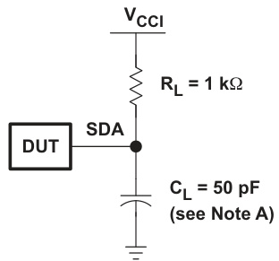

# TCA6424 Low-Voltage 24-Bit I2C AND SMBus I/O Expander With Interrupt Output, Reset, and Configuration Registers

Not Recommended for New Designs

# 1 Features

Operating Power-Supply Voltage Range of 1.65 V to 5.5 V

Allows Bidirectional Voltage-Level Translation and   
GPIO Expansion Between: 1.8-V SCL/SDA and 1.8-V, 2.5-V, 3.3-V, or 5-V P Port 2.5-V SCL/SDA and 1.8-V, 2.5-V, 3.3-V, or 5-V P Port 3.3-V SCL/SDA and 1.8-V, 2.5-V, 3.3-V, or 5-V P Port 5-V SCL/SDA and 1.8-V, 2.5-V, 3.3-V, or 5-V P Port   
$1 ^ { 2 } { \mathsf { C } }$ to Parallel Port Expander   
Low Standby Current Consumption of $1 \mu \mathsf { A }$   
Schmitt-Trigger Action Allows Slow Input   
Transition and Better Switching Noise Immunity at   
the SCL and SDA Inputs $V _ { \mathrm { h y s } } = 0 . 1 8 \ : \forall$ Typ at $1 . 8 \lor$ $\mathsf { V } _ { \mathsf { h y s } } = 0 . 2 5 \ : \mathsf { V }$ Typ at $2 . 5 \vee$   
– $\mathsf { V } _ { \mathsf { h y s } } = 0 . 3 3 \ : \vee$ Typ at $3 . 3 \ : \mathsf { V }$   
– $\mathsf { V } _ { \mathsf { h y s } } = 0 . 5 \ : \mathsf { V }$ Typ at $5 \vee$   
5-V Tolerant I/O Ports   
Active-Low Reset (RESET) Input   
Open-Drain Active-Low Interrupt $( \overline { { | \mathsf { N } \bar { \mathsf { I } } } } )$ Output   
400-kHz Fast $1 ^ { 2 } { \mathsf { C } }$ Bus   
Input/Output Configuration Register   
Polarity Inversion Register   
Internal Power-On Reset   
Power Up With All Channels Configured as Inputs   
No Glitch On Power Up   
Noise Filter on SCL/SDA Inputs   
Latched Outputs With High-Current Drive   
Maximum Capability for Directly Driving LEDs   
Latch-Up Performance Exceeds 100 mA Per   
JESD 78, Class II   
ESD Protection Exceeds JESD 22 2000-V Human-Body Model (A114-A) 200-V Machine Model (A115-A) 1000-V Charged-Device Model (C101)

# 2 Description

This 24-bit $1 / \mathsf { O }$ expander for the two-line bidirectional bus $( | ^ { 2 } \mathsf { C } )$ is designed to provide general-purpose remote I/O expansion for most microcontroller families via the ${ \mathsf { I } } ^ { 2 } { \mathsf { C } }$ interface [serial clock (SCL) and serial data (SDA)].

The major benefit of this device is its wide $\mathsf { V } _ { \mathsf { C C } }$ range. It can operate from $1 . 6 5 \mathrm { ~ V ~ }$ to $5 . 5 \vee$ on the P-port side and on the SDA/SCL side. This allows the TCA6424 to interface with next-generation microprocessors and microcontrollers on the SDA/SCL side, where supply levels are dropping down to conserve power. In contrast to the dropping power supplies of microprocessors and microcontrollers, some PCB components, such as LEDs, remain at a 5-V power supply.

The bidirectional voltage level translation in the TCA6424 is provided through $\mathsf { V } _ { \mathsf { C C l } }$ . $\mathsf { V } _ { \mathsf { C C I } }$ should be connected to the $\mathsf { V } _ { \mathsf { C C } }$ of the external SCL/SDA lines. This indicates the $\mathsf { V } _ { \mathsf { C C } }$ level of the $\mathsf { I } ^ { 2 } \mathsf { C }$ bus to the TCA6424. The voltage level on the $\mathsf { P }$ -port of the TCA6424 is determined by the VCCP.

Device Information(1)   

<html><body><table><tr><td>PART NUMBER</td><td>PACKAGE</td><td>BODY SIZE (NOM)</td></tr><tr><td>TCA6424</td><td>UQFN (32)</td><td>5.00 mm  5.00 mm</td></tr></table></body></html>

(1) For all available packages, see the orderable addendum at the end of the datasheet.

RGJ PACKAGE (BOTTOM VIEW) e e 2 2 2 o o 1 2 3 4 5 6 7 8 OOOOOOOC INT 32 9 P10 VCCI 31 10 P11 SDA 30 11 P12 SCL 29 12 P13   
RESET 28 13 P14 $\mathsf { V } _ { \mathsf { C C P } }$ 27 14 P15   
ADDR 26 15 P16 GND 25 16 P17 DOOOOOOO 24 23 22 21 20 19 18 17 2 20 122222

# Table of Contents

1 Features 1   
2 Description .. 1   
3 Revision History. 2   
4 Description (Continued). 3   
5 Pin Configuration and Functions. 4   
6 Specifications.. 5   
6.1 Absolute Maximum Ratings 5   
6.2 Handling Ratings.. 5   
6.3 Recommended Operating Conditions. 5   
6.4 Electrical Characteristics. 6   
6.5 I2C Interface Timing Requirements. 7   
6.6 Reset Timing Requirements 7   
6.7 Switching Characteristics 7   
6.8 Typical Characteristics 8   
7 Parameter Measurement Information . 11   
8 Detailed Description . 15   
8.1 Functional Block Diagram .. 15   
8.2 Device Functional Modes.. 17   
8.3 Programming. 19   
9 Application And Implementation. 26   
9.1 Typical Application . 26   
10 Power Supply Recommendations 28   
10.1 Power-On Reset Requirements 28   
11 Device and Documentation Support 30   
11.1 Trademarks. 30   
11.2 Electrostatic Discharge Caution.. 30   
11.3 Glossary . 30   
12 Mechanical, Packaging, and Orderable   
Information .. 30

# 3 Revision History

Changes from Revision A (November 2009) to Revision B Page

Added RESET Errata section. 17   
Added Interrupt Errata section 18

# 4 Description (Continued)

The TCA6424 consists of three 8-bit Configuration (input or output selection), Input, Output, and Polarity Inversion (active high) registers. At power on, the I/Os are configured as inputs. However, the system master can enable the I/Os as either inputs or outputs by writing to the I/O configuration bits. The data for each input or output is kept in the corresponding input or output register. The polarity of the Input Port register can be inverted with the Polarity Inversion register. All registers can be read by the system master.

The system master can reset the TCA6424 in the event of a timeout or other improper operation by asserting a low in the RESET input. The power-on reset puts the registers in their default state and initializes the ${ \mathsf { I } } ^ { 2 } { \mathsf { C } } _ { I }$ /SMBus state machine. The RESET pin causes the same reset/initialization to occur without depowering the part.

The TCA6424 open-drain interrupt $( \overline { { | \mathsf { N } | } } )$ output is activated when any input state differs from its corresponding Input Port register state and is used to indicate to the system master that an input state has changed.

INT can be connected to the interrupt input of a microcontroller. By sending an interrupt signal on this line, the remote I/O can inform the microcontroller if there is incoming data on its ports without having to communicate via the $\mathsf { I } ^ { 2 } \mathsf { C }$ bus. Thus, the TCA6424 can remain a simple slave device.

The device P-port outputs have high-current sink capabilities for directly driving LEDs while consuming lo device current.

One hardware pin (ADDR) can be used to program and vary the fixed $1 ^ { 2 } { \mathsf { C } }$ address and allow up to two devices to hare the same $\mathsf { I } ^ { 2 } \mathsf { C }$ bus or SMBus.

# 5 Pin Configuration and Functions

RGJ PACKAGE (BOTTOM VIEW) RE882286 1 2 3 4 5 6 7 8 OUUUUUUU INT 32 9 P10 VCCI 31 10 P11 SDA 30 11 P12 SCL 29 ( 12 P13   
RESET 28 ( 13 P14 VCCP 27 C 14 P15   
ADDR 26 15 P16 GND 25 16 P17 nOnnnnnn 24 23 22 21 20 19 18 17 2 1122222

# Pin Functions

<html><body><table><tr><td colspan="2">TERMINAL</td><td rowspan="2">DESCRIPTION</td></tr><tr><td>PIN NO.</td><td>NAME</td></tr><tr><td>1</td><td>P00</td><td>P-port input/output (push-pull design structure). At power on, P00 is configured as an input.</td></tr><tr><td>2</td><td>P01</td><td>P-port input/output (push-pull design structure). At power on, P01 is configured as an input.</td></tr><tr><td>3</td><td>P02</td><td>P-port input/output (push-pull design structure). At power on, P02 is configured as an input.</td></tr><tr><td>4</td><td>P03</td><td>P-port input/output (push-pull design structure). At power on, P03 is configured as an input.</td></tr><tr><td>5</td><td>P04</td><td>P-port input/output (push-pull design structure). At power on, P04 is configured as an input.</td></tr><tr><td>6</td><td>P05</td><td>P-port input/output (push-pull design structure). At power on, P05 is configured as an input.</td></tr><tr><td>7</td><td>P06</td><td>P-port input/output (push-pull design structure). At power on, P06 is configured as an input.</td></tr><tr><td>8</td><td>P07</td><td>P-port input/output (push-pull design structure). At power on, P07 is configured as an input.</td></tr><tr><td>9</td><td>P10</td><td>P-port input/output (push-pull design structure). At power on, P10 is configured as an input.</td></tr><tr><td>10</td><td>P11</td><td>P-port input/output (push-pull design structure). At power on, P11 is configured as an input.</td></tr><tr><td>11</td><td>P12</td><td>P-port input/output (push-pull design structure). At power on, P12 is configured as an input.</td></tr><tr><td>12</td><td>P13</td><td>P-port input/output (push-pull design structure). At power on, P13 is configured as an input.</td></tr><tr><td>13</td><td>P14</td><td>P-port input/output (push-pull design structure). At power on, P14 is configured as an input.</td></tr><tr><td>14</td><td>P15</td><td>P-port input/output (push-pull design structure). At power on, P15 is configured as an input.</td></tr><tr><td>15</td><td>P16</td><td>P-port input/output (push-pull design structure). At power on, P16 is configured as an input.</td></tr><tr><td>16</td><td>P17</td><td>P-port input/output (push-pull design structure). At power on, P17 is configured as an input.</td></tr><tr><td>17</td><td>P20</td><td>P-port input/output (push-pull design structure). At power on, P20 is configured as an input.</td></tr><tr><td>18</td><td>P21</td><td></td></tr><tr><td>19</td><td>P22</td><td>P-port input/output (push-pull design structure). At power on, P21 is configured as an input.</td></tr><tr><td>20</td><td>P23</td><td>P-port input/output (push-pull design structure). At power on, P22 is configured as an input.</td></tr><tr><td></td><td>P24</td><td>P-port input/output (push-pull design structure). At power on, P23 is configured as an input.</td></tr><tr><td>21</td><td>P25</td><td>P-port input/output (push-pull design structure). At power on, P24 is configured as an input.</td></tr><tr><td>22</td><td>P26</td><td>P-port input/output (push-pull design structure). At power on, P25 is configured as an input.</td></tr><tr><td>23</td><td></td><td>P-port input/output (push-pull design structure). At power on, P26 is configured as an input.</td></tr><tr><td>24</td><td>P27 GND</td><td>P-port input/output (push-pull design structure). At power on, P27 is configured as an input.</td></tr><tr><td>25</td><td>ADDR</td><td>Ground</td></tr><tr><td>26</td><td>VCCP</td><td>Address input. Connect directly to Vccp or ground.</td></tr><tr><td>27 28</td><td>RESET</td><td>Supply voltage of TCA6424 for P port</td></tr><tr><td>29</td><td>SCL</td><td>Active-low reset input. Connect to Vccp through a pullup resistor, if no active connection is used. Serial clock bus. Connect to Vcci through a pullup resistor.</td></tr><tr><td>30</td><td>SDA</td><td>Serial data bus. Connect to Vcci through a pullup resistor.</td></tr><tr><td></td><td></td><td>Supply voltage of I?C bus. Connect directly to the Vcc of the external I?C master. Provides voltage-level</td></tr><tr><td>31 32</td><td>iNT VccI</td><td>translation. Interrupt output. Connect to Vcci through a pullup resistor.</td></tr></table></body></html>

# 6 Specifications

# 6.1 Absolute Maximum Ratings(1)

over operating free-air temperature range (unless otherwise noted)

<html><body><table><tr><td colspan="4"></td><td> MIN</td><td>MAX</td><td>UNIT</td></tr><tr><td colspan="4">VccI Supply voltage range</td><td>0.5</td><td>6.5</td><td>v</td></tr><tr><td colspan="4">VCcP Supply voltage range</td><td>0.5</td><td>6.5</td><td>v</td></tr><tr><td colspan="4">V Input voltage range(2)</td><td>0.5</td><td>6.5</td><td>v</td></tr><tr><td colspan="4">Output voltage range(2)</td><td>0.5</td><td>6.5</td><td>v</td></tr><tr><td>Vo lIK</td><td>Input clamp current</td><td>ADDR, RESET, SCL</td><td>V<0</td><td></td><td>+20</td><td>mA</td></tr><tr><td colspan="2">lOK Output clamp current</td><td>INT</td><td>Vo<0</td><td></td><td>+20</td><td>mA</td></tr><tr><td colspan="2"></td><td>P port</td><td>Vo <0 or Vo> Vccp</td><td></td><td>+20</td><td></td></tr><tr><td rowspan="3">lOK</td><td rowspan="3">Input/output clamp current</td><td>SDA</td><td>Vo < 0 or Vo > Vcci</td><td></td><td>+20</td><td rowspan="3">mA</td></tr><tr><td>P port</td><td>Vo = 0 to Vccp</td><td></td><td>25 mA</td></tr><tr><td>SDA, INT</td><td>Vo = 0 to Vcci</td><td></td><td></td></tr><tr><td colspan="2">IOH Continuous output high current</td><td>P port</td><td>Vo = 0 to Vccp</td><td></td><td>15</td><td></td></tr><tr><td rowspan="3">Icc</td><td colspan="4">Continuous current through GND</td><td>25 200</td><td>mA</td></tr><tr><td colspan="4">Continuous current through VCCp</td><td>160</td><td>mA</td></tr><tr><td colspan="4">Continuous current through VccI</td><td>10</td><td></td></tr><tr><td>OJA</td><td colspan="2"> Package thermal impedance(3)</td><td> RGJ package</td><td></td><td>50.05</td><td>C/W</td></tr></table></body></html>

(1) Stresses beyond those listed under Absolute Maximum Ratings may cause permanent damage to the device. These are stress ratings only, and functional operation of the device at these or any other conditions beyond those indicated under Recommended Operating Conditions is not implied. Exposure to absolute-maximum-rated conditions for extended periods may affect device reliability.   
(2) The input negative-voltage and output voltage ratings may be exceeded if the input and output current ratings are observed.   
(3) The package thermal impedance is calculated in accordance with JESD 51-7.

# 6.2 Handling Ratings

<html><body><table><tr><td colspan="3"></td><td>MIn</td><td>MAX</td><td>UNIT</td></tr><tr><td colspan="3">Storage temperature range Tstg</td><td>-65</td><td>150</td><td>oC</td></tr><tr><td rowspan="2">V(ESD)</td><td rowspan="2">Electrostatic discharge</td><td>puman body model (HBM), per ANSI/ESDA/JEDEC JS-01,al</td><td>0</td><td>2000</td><td rowspan="2"></td></tr><tr><td>hared- deice mode (CDM). per JEDE specification</td><td>0</td><td>1000</td></tr></table></body></html>

(1) JEDEC document JEP155 states that 500-V HBM allows safe manufacturing with a standard ESD control process.   
(2) JEDEC document JEP157 states that 250-V CDM allows safe manufacturing with a standard ESD control process.

# 6.3 Recommended Operating Conditions

<html><body><table><tr><td colspan="3"></td><td>MIn</td><td>MAX</td><td>UNIT</td></tr><tr><td>VocI</td><td>Supply voltagee</td><td></td><td>1.65</td><td>5.5</td><td></td></tr><tr><td>VCCP</td><td>Supply voltagee</td><td></td><td>1.65</td><td>5.5</td><td rowspan="2">v</td></tr><tr><td rowspan="2">VIH</td><td rowspan="2">High-level input voltage</td><td rowspan="2">SCL, SDA</td><td>0.7 x VccI</td><td>5.5</td></tr><tr><td>0.7 x VCCP</td><td>5.5</td><td rowspan="2">v</td></tr><tr><td rowspan="2">VIL</td><td rowspan="2">Low-level input voltage.</td><td>ADDR, P27-P00, RESET SCL, SDA</td><td>-0.5</td><td>0.3 x VccI</td><td rowspan="2"></td></tr><tr><td>ADDR, P27-P00, RESET</td><td>-0.5</td><td>0.3 x VCcp</td><td>v</td></tr><tr><td></td><td>High-level output current</td><td>P27-P00</td><td></td><td>10</td><td></td><td>mA</td></tr><tr><td>lOH</td><td>Low-level output current</td><td>P27-P00</td><td></td><td></td><td>25</td><td>mA</td></tr><tr><td>TA</td><td colspan="2">Operating free-air temperature</td><td colspan="2">-40</td><td>85</td><td>C</td></tr></table></body></html>

# 6.4 Electrical Characteristics

over recommended operating free-air temperature range, $\mathsf { V } _ { \mathsf { C C I } } = 1 . 6 5 \ : \mathsf { V }$ to $5 . 5 \vee$ (unless otherwise noted)   

<html><body><table><tr><td colspan="2">PARAMETER</td><td>TEST CONDITIONS</td><td>VcCP</td><td>MIN</td><td>Typ(1)</td><td>MAX UNIT</td></tr><tr><td>VIK</td><td colspan="2">Vopu iode amp I =-18 mA</td><td>1.65 V to 5.5 V</td><td>1.2</td><td></td><td>v</td></tr><tr><td>VPOR</td><td colspan="2">Power-on reset voltage VI = Vccp or GND, Io = 0</td><td>1.65 V to 5.5 V</td><td></td><td>1</td><td>1.4 v</td></tr><tr><td rowspan="6">VOH</td><td rowspan="6">P-port high-level output voltage</td><td rowspan="3">IOH = -8 mA</td><td>1.65 V</td><td>1.2</td><td></td><td rowspan="6"></td></tr><tr><td>2.3 V</td><td>1.8</td><td></td></tr><tr><td>3 V</td><td>2.6</td><td></td></tr><tr><td>4.5 V</td><td>4.1</td><td></td><td>v</td></tr><tr><td></td><td>1.65 V</td><td>1</td><td></td></tr><tr><td rowspan="3">IOH = -10 mA</td><td rowspan="3"></td><td>2.3 V</td><td>1.7</td><td></td></tr><tr><td>3 V</td><td>2.5</td><td></td></tr><tr><td>4.5 V 1.65 V</td><td>4.0</td><td></td></tr><tr><td rowspan="6">VOL</td><td rowspan="6">IOL = 8mA P-port low-level output. voltage</td><td rowspan="6">IOL = 10 mA</td><td>2.3 V</td><td></td><td>0.45</td><td rowspan="6">v</td></tr><tr><td>3 V</td><td></td><td>0.25</td></tr><tr><td>4.5 V</td><td></td><td>0.25 0.23</td></tr><tr><td>1.65 V</td><td></td><td></td></tr><tr><td>2.3 V</td><td></td><td>0.6</td></tr><tr><td>3 V</td><td></td><td>0.3</td></tr><tr><td rowspan="3">loL</td><td colspan="2">SDA</td><td>4.5 V</td><td></td><td>0.25 0.24</td><td rowspan="3">mA</td></tr><tr><td></td><td>VOL = 0.4 V</td><td>1.65 V to 5.5 V</td><td>3</td><td></td></tr><tr><td>Int</td><td>VOL = 0.4 V</td><td>1.65 V to 5.5 V 3</td><td>15</td><td></td></tr><tr><td></td><td> SCL, SDA</td><td>V = VccI or GND</td><td></td><td></td><td>+0.1</td><td></td></tr><tr><td></td><td colspan="2"> ADDR, RESET</td><td>1.65 V to 5.5 V</td><td></td><td></td><td>A 0.1</td></tr><tr><td>IH IL</td><td colspan="2" rowspan="2">P port P port</td><td>Vj = Vccp or GND Vj = VccP VI = GND</td><td colspan="2">1.65 V to 5.5 V</td><td rowspan="2">1 A 1 A 30</td></tr><tr><td rowspan="2">Operating mode</td><td rowspan="2">Vi on SDA = Ycc or GND, RESET = VCCP.</td><td>1.65 V to 5.5 V</td><td>8</td></tr><tr><td>fsCL = 100 kHz V! on SCL and SDA = Vcci or</td><td>1.65 V to 5.5 V</td><td>1.7 10 0.1 2</td></tr><tr><td></td><td></td><td>ARSET SDA</td><td>Io = 0, I/O = inputs, fSCL = 0 One inpuat rve or GND RESET  VCCP.</td><td rowspan="3"></td><td rowspan="3"></td><td rowspan="3">25 A</td></tr><tr><td>Alcci</td><td> Additional</td><td></td><td>1.65 V to 5.5 V</td></tr><tr><td>SlcCP</td><td></td><td></td><td>1.65 V to 5.5 V</td></tr><tr><td>C</td><td colspan="2">SCL SDA</td><td>VI = VccI or GND VIo = VccI or GND</td><td></td><td>6 7</td><td> pF</td></tr><tr><td>Cio</td><td colspan="2"></td><td></td><td>1.65 V to 5.5 V</td><td>7</td><td>8 pF</td></tr><tr><td></td><td colspan="2"></td><td></td><td></td><td></td><td></td></tr><tr><td></td><td colspan="2">P port</td><td>VIo = Vccp or GND</td><td></td><td>7.5 8.5</td><td></td></tr></table></body></html>

(1) Except for $\mathsf { I } _ { \mathsf { C C } }$ , all typical values are at nominal supply voltage $( \mathsf { V } _ { \mathsf { C C P } } = \mathsf { V } _ { \mathsf { C C l } } = 1 . 8 – \mathsf { V }$ , 2.5-V, 3.3-V, or $\mathsf { S - V } \mathsf { V } _ { \mathsf { C C } } )$ ) and ${ \sf T } _ { \sf A } = 2 5 ^ { \circ } { \sf C }$ . For $\mathsf { I } _ { \mathsf { C C } }$ , al typical values are at $\mathsf { V } _ { \mathsf { C C P } } = \mathsf { V } _ { \mathsf { C C l } } = 3 . 3 \mathsf { V }$ and ${ \bar { \mathsf { T } } } _ { \mathsf { A } } = 2 5 ^ { \circ } { \mathsf { C } }$ .

# 6.5 I2C Interface Timing Requirements

over recommended operating free-air temperature range (unless otherwise noted) (see Figure 14)

<html><body><table><tr><td rowspan="2"></td><td colspan="2">STANDARD MODE IC BuS</td><td colspan="2">FAST MODE IC BuS</td><td rowspan="2">UNIT</td></tr><tr><td>MIN</td><td>MAX</td><td> MIN</td><td>mAX</td></tr><tr><td>fscl</td><td>IC clock frequency</td><td>0</td><td>100</td><td>0</td><td>400</td><td>kHz</td></tr><tr><td>tsch</td><td>IC clock high timee</td><td>4</td><td></td><td>0.6</td><td></td><td> s</td></tr><tr><td>tscl</td><td>IC clock low timee</td><td>4.7</td><td></td><td>1.3</td><td></td><td> s</td></tr><tr><td>tsp</td><td>IC spike time</td><td>0</td><td>50</td><td>0</td><td>50</td><td> ns</td></tr><tr><td>tsds</td><td>IC serial data setup time</td><td>250</td><td></td><td>100</td><td></td><td> ns</td></tr><tr><td>tsdh</td><td>I2C serial data hold time</td><td>0</td><td></td><td>0</td><td></td><td> ns</td></tr><tr><td>ticr</td><td>IC input rise time</td><td></td><td>1000</td><td>20 + 0.1Cp (1)</td><td>300</td><td> ns</td></tr><tr><td>ticf</td><td>I?C input fall time.</td><td></td><td>300</td><td>20 + 0.1Cp (1)</td><td>300</td><td>ns</td></tr><tr><td>tocf</td><td>I2C output fall time; 10 pF to 400 pF bus</td><td></td><td>300</td><td>20 + 0.1C, (1)</td><td>300</td><td> s</td></tr><tr><td>tbuf</td><td>I?C bus free time between Stop and Start</td><td>4.7</td><td></td><td>1.3</td><td></td><td> s</td></tr><tr><td>tsts</td><td>IC Start or repeater Start condition setup time</td><td>4.7</td><td></td><td>0.6</td><td></td><td>s</td></tr><tr><td>tsth</td><td>IC Start or repeater Start condition hold time</td><td>4</td><td></td><td>0.6</td><td></td><td></td></tr><tr><td>tsps</td><td>Ic Stop condition setup time</td><td>4</td><td></td><td>0.6</td><td></td><td> s</td></tr><tr><td>tvd(data)</td><td>Valid data time; SCL low to SDA output valid</td><td></td><td>1</td><td></td><td>1</td><td> S</td></tr><tr><td>tvd(ack)</td><td>Valid data time of ACK condition; ACK signal from SCL low to SDA (out) low</td><td></td><td>1</td><td></td><td>1</td><td> s</td></tr></table></body></html>

(1) ${ \mathsf { C } } _ { \mathsf { b } } =$ total capacitance of one bus line in pF

# 6.6 Reset Timing Requirements

over recommended operating free-air temperature range (unless otherwise noted) (see Figure 17)

<html><body><table><tr><td rowspan="2"></td><td>STANDARD MODE FC BUS</td><td>FAST MODEE IC BUS</td><td></td><td rowspan="2">UNIT</td></tr><tr><td>MIN MAX</td><td>MIN</td><td>MAX</td><td></td></tr><tr><td>tw Reset pulse duration</td><td></td><td>4</td><td>4</td><td></td><td>ns</td></tr><tr><td>tREC Reset recovery time</td><td></td><td>0</td><td>0</td><td></td><td>ns</td></tr><tr><td>RESET Time to reset(1)</td><td></td><td>600</td><td>600</td><td></td><td>ns</td></tr></table></body></html>

(1) Minimum time for SDA to become high or minimum time to wait before doing a START.

# 6.7 Switching Characteristics

over recommended operating free-air temperature range, $\mathsf C _ { \mathsf C } \leq 1 0 0$ pF (unless otherwise noted) (see Figure 14)   

<html><body><table><tr><td rowspan="2">PARAMETER</td><td rowspan="2">FROM</td><td rowspan="2"></td><td colspan="2">STANDARD MODE ?C BuS</td><td colspan="2">FAST MODE IC BuS</td><td rowspan="2">UNIT</td></tr><tr><td> MIN</td><td>MAX</td><td>MIN MAX</td></tr><tr><td>tiv Interrupt valid time</td><td></td><td>P port</td><td>inT</td><td></td><td>4</td><td>4</td><td>ps</td></tr><tr><td>tIR Interrupt reset delay time</td><td></td><td> SCL</td><td>int</td><td></td><td>4</td><td>4</td><td>ps</td></tr><tr><td>tpv Output data valid</td><td></td><td> SCL</td><td>P27-P00</td><td>400</td><td></td><td>400</td><td>ns</td></tr><tr><td>tps Input data setup time</td><td></td><td>P port</td><td> SCL</td><td>0</td><td>0</td><td></td><td>ns</td></tr><tr><td>tPH Input data hold time</td><td></td><td>P port</td><td>SCL</td><td>300</td><td>300</td><td></td><td>ns</td></tr></table></body></html>

# 6.8 Typical Characteristics

${ \sf T } _ { \sf A } = 2 5 ^ { \circ } { \sf C }$ (unless otherwise noted)

100 fSCL = 400 kHz 9 SCL = VCC   
102030405060708090Supply Current,µA)I(CC All I/OVs u=n 5o aVded Supply Current,µA)I(CC2345678 All I/Os unloaded V = 5 V VCC = 3.3 V VCC = 3.3 V VCC = 2.5 V VCC = 2.5 V 7 7 VCC = 1.8 V 1 ${ \tt V } _ { \tt C C } = 1 . 8 { \tt V }$ 0 0 -40 -15 10 35 60 85 –40 –15 10 35 60 85 Temperature, ${ \sf T } _ { \sf A } \left( { \mathrm { } } ^ { \circ } { \sf C } \right)$ Temperature,T (°C) Figure 1. Supply Current vs Temperature Figure 2. Standby Supply Current vs Temperature 100 fSCL = 400 kHz 20 VCC = 1.8 V 90 All I/Os unloaded 18 T = –40°C   
Supply Current, I(µA)CC20304050607080 46810121416Sink Current,(mA)ISINK T = 25°C T = 85°C 10 2 0 0 1.65 2.0 2.5 3.0 3.5 4.0 4.5 5.0 5.5 0 0.1 0.2 0.3 0.4 0.5 0.6 Supply Voltage, VCC (V) Output Low Voltage, $\mathsf { v } _ { \mathrm { { o L } } }$ (V) Figure 3. Supply Current vs Supply Voltage Figure 4. I/O Sink Current vs Output Low Voltage 24 VCC = 2.5 V 50 VCC = 3.3 V   
246810121416182022Sink Current,mA)I(SINK T = –40°C 51015202530354045Sink Current,mA)I(SINK T = 25T°C= –40°C y T = 85°C $T _ { \mathsf { A } } = 8 5 ^ { \circ } { \mathsf { C } }$ 5 0 0 0.1 0.2 0.3 0.4 0.5 0.6 0 0.1 0.2 0.3 0.4 0.5 0.6 Output Low Voltage, $\mathsf { v } _ { \mathrm { { o L } } }$ (V) Output Low Voltage, $\mathsf { v } _ { \mathrm { o } \mathrm { { L } } }$ (V) Figure 5. I/O Sink Current vs Output Low Voltage Figure 6. I/O Sink Current vs Output Low Voltage

# Typical Characteristics (continued)

${ \sf T } _ { \sf A } = 2 5 ^ { \circ } { \sf C }$ (unless otherwise noted)

50 VCC = 5 V 400   
1015202530354045Sink Current,(mA)ISINK T = –40°C 501001502002503003500Output Low Voltage,mV)V(OL VCC = 5 V, ISINK = 10 mA T = 25°C 7 VCC = 1.8 V, ISINK = 10 mA VCC = 5 V, ISINK = 1 mA 5 $T _ { A } = 8 5 ^ { \circ } C$ VCC = 1.8 V, ISINK = 1 mA 0 0 0.1 0.2 0.3 0.4 0.5 −40 −15 10 35 60 85 Output Low Voltage, $\mathsf { v } _ { \mathrm { { o } } \bot }$ (V) Temperature, T (°C) Figure 7. I/O Sink Current vs Output Low Voltage Figure 8. I/O Low Voltage vs Temperature 20 VCC = 1.8 V 25 VCC = 2.5 V   
Source Current,mA)I(SOURCE T = –40°C Source Current,mA)I(SOURCE T = –40°C 16 20 T = 25°C 7 T = 25°C 12 15 8 10 T = 85°C T = 85°C 4 5 0 0 0 0.1 0.2 0.3 0.4 0.5 0.6 0.7 0 0.1 0.2 0.3 0.4 0.5 0.6 0.7 ${ \pmb { \mathsf { V } } } _ { \mathtt { c c } } - { \pmb { \mathsf { V } } } _ { \mathtt { o H } } ( { \pmb { \mathsf { V } } } )$ VCC – VOH (V)   
Figure 9. I/O Source Current vs Output High Voltage Figure 10. I/O Source Current vs Output High Voltage 50 50 VCC = 3.3 V VCC = 5 V   
51015202530354045Source Current,mA)I(SOURCE 51015202530354045Source Current,mA)I(SOURCE T –40°C T = –40°C T = 25°C T = 25°C 7 T = 85°C T = 85°C 0 0 0 0.1 0.2 0.3 0.4 0.5 0.6 0.7 0 0.1 0.2 0.3 0.4 0.5 0.6 VCC – VOH (V) VCC – VOH (V)   
Figure 11. I/O Source Current vs Output High Voltage Figure 12. I/O Source Current vs Output High Voltage

# Typical Characteristics (continued)

${ \sf T } _ { \sf A } = 2 5 ^ { \circ } { \sf C }$ (unless otherwise noted)

  
Figure 13. I/O High Voltage vs Temperature

# 7 Parameter Measurement Information

<html><body><table><tr><td colspan="2"></td><td colspan="8"></td></tr><tr><td></td><td></td><td></td><td></td><td></td><td></td><td></td><td></td><td></td><td></td><td></td></tr><tr><td></td><td></td><td>Coniaion</td><td></td><td></td><td>Address</td><td></td><td></td><td></td><td></td><td></td><td>Condion</td></tr><tr><td>Contiion</td><td></td><td></td><td></td><td></td><td></td><td></td><td>ACK</td><td></td><td></td><td></td><td></td></tr></table></body></html>

VOLTAGE WAVEFORMS   

<html><body><table><tr><td>BYTE</td><td>DESCRIPTION</td></tr><tr><td>1</td><td>?C address</td></tr><tr><td>2</td><td>Input register port data</td></tr></table></body></html>

  
Figure 14. I2C Interface Load Circuit And Voltage Waveforms

A. $C _ { \mathsf { L } }$ includes probe and jig capacitance. tocf is measured with $\mathsf { C } _ { \mathsf { L } }$ of 10 pF or 400 pF.   
B. All inputs are supplied by generators having the following characteristics: PRR $\leq 1 0 \ M H z$ , $Z _ { 0 } = 5 0 \Omega$ , $ { \mathrm { I } _ { \mathrm { r } } } /  { \mathrm { I } _ { \mathrm { f } } } \leq 3 0$ ns.   
C. All parameters and waveforms are not applicable to all devices. A. $\mathsf { C } _ { \mathsf { L } }$ includes probe and jig capacitance.   
B. All inputs are supplied by generators having the following characteristics: PRR $\leq 1 0 \ M H z$ , $Z _ { 0 } = 5 0 \Omega$ , $ { \mathrm { \ t } } _ { \Gamma } /  { \mathrm { t } } _ { \Gamma } \leq 3 0$ ns.   
C. All parameters and waveforms are not applicable to all devices. A. $\mathsf { C } _ { \mathsf { L } }$ includes probe and jig capacitance.   
B. $\mathfrak { t } _ { \mathfrak { p v } }$ is measured from $0 . 7 \times \mathsf { V } _ { \mathsf { C C } }$ on SCL to $50 \%$ I/O $( { \mathsf { P n } } )$ output.   
C. All inputs are supplied by generators having the following characteristics: $\mathsf { P R R } \leq 1 0 ~ \mathsf { M H z }$ , $Z _ { 0 } = 5 0 \Omega$ , $ { \mathrm { \ t } } _ { \mathsf { r } } /  { \mathsf { t } } _ { \mathsf { f } } \leq 3 0$ ns.   
D. The outputs are measured one at a time, with one transition per measurement.   
E. All parameters and waveforms are not applicable to all devices.

  
INTERRUPT LOAD CONFIGURATION

  
Figure 15. Interrupt Load Circuit And Voltage Waveforms

  
P PORT LOAD CONFIGURATION

  
Figure 16. P-Port Load Circuit And Timing Waveforms

# Parameter Measurement Information (continued)

  
P PORT LOAD CONFIGURATION

  
Figure 17. Reset Load Circuits And Voltage Waveforms

A. $C _ { \mathsf { L } }$ includes probe and jig capacitance.   
B. All inputs are supplied by generators having the following characteristics: $\mathsf { P R R } \leq 1 0 ~ \mathsf { M H z }$ , $Z _ { 0 } = 5 0 \Omega$ , $ { \mathrm { \ t } } _ { \Gamma } /  { \mathrm { t } } _ { \Gamma } \leq 3 0$ ns.   
C. The outputs are measured one at a time, with one transition per measurement.   
D. I/Os are configured as inputs.   
E. All parameters and waveforms are not applicable to all devices.

# 8 Detailed Description

# 8.1 Functional Block Diagram

  
Figure 18. Logic Diagram (Positive Logic)

A. All I/Os are set to inputs at reset.   
B. Pin numbers shown are for the RGJ package.

# Functional Block Diagram (continued)

  
Figure 19. Simplified Schematic Of P00 To P27

A. On power up or reset, all registers return to default values.

# 8.2 Device Functional Modes

# 8.2.1 Voltage Translation

Table 1 shows how to set up $\mathsf { V } _ { \mathsf { C C } }$ levels for the necessary voltage translation between the $1 ^ { 2 } { \mathsf { C } }$ bus and the TCA6424.

Table 1. Voltage Translation   

<html><body><table><tr><td>VccI (SDA AND SCL OF I2C MASTER) (V)</td><td>VCCP (P PORT) (V)</td></tr><tr><td>1.8</td><td>1.8</td></tr><tr><td>1.8</td><td>2.5</td></tr><tr><td>1.8</td><td>3.3</td></tr><tr><td>1.8</td><td>5</td></tr><tr><td>2.5</td><td>1.8</td></tr><tr><td>2.5</td><td>2.5</td></tr><tr><td>2.5</td><td>3.3</td></tr><tr><td>2.5</td><td>5</td></tr><tr><td>3.3</td><td>1.8</td></tr><tr><td>3.3</td><td>2.5</td></tr><tr><td>3.3</td><td>3.3</td></tr><tr><td>3.3</td><td>5</td></tr><tr><td>5</td><td>1.8</td></tr><tr><td>5</td><td>2.5</td></tr><tr><td>5</td><td>3.3</td></tr><tr><td>5</td><td>5</td></tr></table></body></html>

# 8.2.2 Reset Input (RESET)

The RESET input can be asserted to initialize the system while keeping the $\mathsf { V } _ { \mathsf { C C P } }$ at its operating level. A reset can be accomplished by holding the RESET pin low for a minimum of $\mathfrak { t } _ { \mathsf { W } }$ . The TCA6424 registers and ${ \mathsf { I } } ^ { 2 } { \mathsf { C } } ,$ /SMBus state machine are changed to their default state once RESET is low (0). When RESET is high (1), the $1 / \mathsf { O }$ levels at the P port can be changed externally or through the master. This input requires a pullup resistor to $\mathsf { V } _ { \mathsf { C C P } }$ , if no active connection is used.

# 8.2.2.1 RESET Errata

If RESET voltage set higher than VCC, current will flow from RESET pin to VCC pin.

# System Impact

VCC will be pulled above its regular voltage level

# System Workaround

Design such that RESET voltage is same or lower than VCC

# 8.2.3 Power-On Reset

When power (from 0 V) is applied to $\mathsf { V } _ { \mathsf { C C P } }$ , an internal power-on reset holds the TCA6424 in a reset condition until $\mathsf { V } _ { \mathsf { C C P } }$ has reached $V _ { P O R }$ . At that time, the reset condition is released, and the TCA6424 registers and I2C/SMBus state machine initializes to their default states. After that, VCCP must be lowered to below 0.2 V and back up to the operating voltage for a power-reset cycle.

# 8.2.4 I/O Port

When an I/O is configured as an input, FETs Q1 and Q2 (in Figure 19) are off, which creates a high-impedance input. The input voltage may be raised above $\mathsf { V } _ { \mathsf { C C } }$ to a maximum of $5 . 5 \dot { \vee }$ .

If the $1 / \mathsf { O }$ is configured as an output, Q1 or Q2 is enabled, depending on the state of the output port register. In this case, there are low-impedance paths between the $1 / \mathsf { O }$ pin and either $\mathsf { V } _ { \mathsf { C C } }$ or GND. The external voltage applied to this $1 / \mathsf { O }$ pin should not exceed the recommended levels for proper operation.

# 8.2.5 Interrupt $( \overline { { \mathbf { I N I } } } )$ Output

An interrupt is generated by any rising or falling edge of the port inputs in the input mode. After time $\mathfrak { t } _ { \mathfrak { w } } .$ , the signal INT is valid. Resetting the interrupt circuit is achieved when data on the port is changed to the original setting, data is read from the port that generated the interrupt or in a stop event. Resetting occurs in the read mode at the acknowledge (ACK) or not acknowledge (NACK) bit after the rising edge of the SCL signal. Interrupts that occur during the ACK or NACK clock pulse can be lost (or be very short) due to the resetting of the interrupt during this pulse. Each change of the I/Os after resetting is detected and is transmitted as $\overline { { \mathsf { I N T } } }$ .

Reading from or writing to another device does not affect the interrupt circuit, and a pin configured as an output cannot cause an interrupt. Changing an $1 / \mathsf { O }$ from an output to an input may cause a false interrupt to occur, if the state of the pin does not match the contents of the Input Port register.

In the TCA6424, an interrupt is not immediately generated by any rising or falling edge of port inputs in input mode after issuing any ${ \mathsf { I } } ^ { 2 } { \mathsf { C } }$ commands (read or write). In order to capture the $\frac { 2 } { 1 1 \sqrt { 7 } }$ in the TCA6424, the user needs to add one more SCL clock pulse after a Stop signal.

The INT output has an open-drain structure and requires a pullup resistor to $\mathsf { V } _ { \mathsf { C C P } }$ or $\mathsf { V } _ { \mathsf { C C l } }$ depending on the application. If the $\overline { { | \mathsf { N } | } }$ signal is connected back to the processor that provides the SCL signal to the TCA6424, then the $\overline { { | \mathsf { N } | } }$ pin has to be connected to $\mathsf { V } _ { \mathsf { C C l } }$ . If not, the INT pin can be connected to $\mathsf { V } _ { \mathsf { C C P } }$ .

# 8.2.5.1 Interrupt Errata

The INT will be improperly de-asserted if the following two conditions occur: 1. The last $1 ^ { 2 } { \mathsf { C } }$ command byte (register pointer) written to the device was 00h.

# NOTE

This generally means the last operation with the device was a Read of the input register. However, the command byte may have been written with 00h without ever going on to read the input register. After reading from the device, if no other command byte written, it will remain 00h.

2. Any other slave device on the $1 ^ { 2 } { \mathsf { C } }$ bus acknowledges an address byte with the R/W bit set high

# System Impact

Can cause improper interrupt handling as the Master will see the interrupt as being cleared.

# System Workaround

Minor software change: User must change command byte to something besides 00h after a Read operation t the TCA6424 device or before reading from another slave device.

# NOTE

Software change will be compatible with other versions (competition and TI redesigns) of this device.

# 8.3 Programming

# 8.3.1 $1 ^ { 2 } C$ Interface

The bidirectional $1 ^ { 2 } { \mathsf { C } }$ bus consists of the serial clock (SCL) and serial data (SDA) lines. Both lines must be connected to a positive supply through a pullup resistor when connected to the output stages of a device. Data transfer may be initiated only when the bus is not busy.

$1 ^ { 2 } { \mathsf { C } }$ communication with this device is initiated by a master sending a Start condition, a high-to-low transition on the SDA input/output, while the SCL input is high (see Figure 20). After the Start condition, the device address byte is sent, most significant bit (MSB) first, including the data direction bit $( { \mathsf { R } } / { \overline { { \mathsf { W } } } } )$ .

After receiving the valid address byte, this device responds with an acknowledge (ACK), a low on the SDA input/output during the high of the ACK-related clock pulse. The address (ADDR) input of the slave device must not be changed between the Start and the Stop conditions.

On the $1 ^ { 2 } { \mathsf { C } }$ bus, only one data bit is transferred during each clock pulse. The data on the SDA line must remain stable during the high pulse of the clock period, as changes in the data line at this time are interpreted as control commands (Start or Stop) (see Figure 21).

A Stop condition, a low-to-high transition on the SDA input/output while the SCL input is high, is sent by th master (see Figure 20).

Any number of data bytes can be transferred from the transmitter to receiver between the Start and the Stop conditions. Each byte of eight bits is followed by one ACK bit. The transmitter must release the SDA line before the receiver can send an ACK bit. The device that acknowledges must pull down the SDA line during the ACK clock pulse, so that the SDA line is stable low during the high pulse of the ACK-related clock period (see Figure 22). When a slave receiver is addressed, it must generate an ACK after each byte is received. Similarly, the master must generate an ACK after each byte that it receives from the slave transmitter. Setup and hold times must be met to ensure proper operation.

A master receiver signals an end of data to the slave transmitter by not generating an acknowledge (NACK) after the last byte has been clocked out of the slave. This is done by the master receiver by holding the SDA line high. In this event, the transmitter must release the data line to enable the master to generate a Stop condition.

  
Figure 20. Definition Of Start And Stop Conditions

  
Figure 21. Bit Transfer

# Programming (continued)

  
Figure 22. Acknowledgment On The $1 ^ { 2 } C$ Bus

# 8.3.2 Register Map

Table 2. Interface Definition   

<html><body><table><tr><td rowspan="2">BYTE</td><td colspan="8">BIT</td></tr><tr><td>7 (MSB)</td><td>6</td><td>5</td><td>4</td><td>3</td><td>2</td><td>1</td><td>0 (LSB)</td></tr><tr><td>IC slave address</td><td>L</td><td>H</td><td>L</td><td>L</td><td>L</td><td>H</td><td>ADDR</td><td>R/W</td></tr><tr><td rowspan="3">I/O data bus</td><td>P07</td><td>P06</td><td>P05</td><td>P04</td><td>P03</td><td>P02</td><td>P01</td><td>P0O</td></tr><tr><td>P17</td><td>P16</td><td>P15</td><td>P14</td><td>P13</td><td>P12</td><td>P11</td><td>P10</td></tr><tr><td>P27</td><td>P26</td><td>P25</td><td>P24</td><td>P23</td><td>P22</td><td>P21</td><td>P20</td></tr></table></body></html>

# 8.3.2.1 Device Address

The address of the TCA6424 is shown in Figure 23.

  
Figure 23. Tca6424 Address

Table 3. Address Reference   

<html><body><table><tr><td>ADDR</td><td>I2C BUS SLAVE ADDRESS</td></tr><tr><td>L</td><td>34 (decimal), 22 (hexadecimal)</td></tr><tr><td>H</td><td>35 (decimal), 23 (hexadecimal)</td></tr></table></body></html>

The last bit of the slave address defines the operation (read or write) to be performed. A high (1) selects a read operation, while a low (0) selects a write operation.

# 8.3.2.2 Control Register And Command Byte

Following the successful acknowledgment of the address byte, the bus master sends a command byte, which is stored in the control register in the TCA6424. Four bits of this data byte state the operation (read or write) and the internal registers (input, output, polarity inversion, or configuration) that will be affected. The control register can be written or read through the $1 ^ { 2 } \dot { \mathsf { C } }$ bus. The command byte is sent only during a write transmission.

The control register includes an Auto-Increment (AI) bit which is the most significant bit (bit 7) of the command byte. At power-up, the control register defaults to 00 (hex), with the AI bit set to logic 1, and the lowest 7 bits set to logic 0.

If AI is 1, the 2 least significant bits are automatically incremented after a read or write. This allows the user to program and/or read the 3 register banks sequentially. If more than 3 bytes of data are written when AI is 1, previous data in the selected registers will be overwritten. Reserved registers are skipped and not accessed (refer to Table 5).

If AI is 0, the 2 least significant bits are not incremented after data is read or written. During a read operation, the same register bank is read each time. During a write operation, data is written to the same register bank each time.

Reserved command codes and command byte outside the range stated in the Command Byte table must not b accessed for proper device functionality.

<html><body><table><tr><td>AI</td><td>B6</td><td>B5</td><td>B4</td><td>B3</td><td>B2</td><td>B1</td><td>BO</td></tr></table></body></html>

Table 4. Command Byte   
(1) Undefined   

<html><body><table><tr><td colspan="11"></td></tr><tr><td></td><td></td><td>CONTROL REGISTER BITS</td><td>B4</td><td>B3</td><td>B2</td><td>B1</td><td>BO</td><td>INCREMENT</td><td>COMMAND</td><td>REGISTER</td><td>PROTOCOL</td><td>POWER-UP DEFAULT</td></tr><tr><td>AI 0</td><td>B6 0</td><td>B5 0</td><td>0</td><td>0</td><td>0</td><td>0</td><td>0</td><td>STATE Disable</td><td>(HEX) 00</td><td></td><td></td><td></td></tr><tr><td>1</td><td>0</td><td>0</td><td>0</td><td>0</td><td>0</td><td>0</td><td>0</td><td>Enable</td><td>80</td><td rowspan="2">Input Port 0</td><td rowspan="2">Read byte</td><td rowspan="2">xxxx xxxx(1)</td></tr><tr><td></td><td>0</td><td>0</td><td>0</td><td>0</td><td>0</td><td>0</td><td>1</td><td>Disable</td></tr><tr><td>0</td><td></td><td></td><td>0</td><td></td><td>0</td><td>0</td><td>1</td><td>Enable</td><td>01</td><td rowspan="2">Input Port 1</td><td rowspan="2">Read byte</td><td rowspan="2">xxxx xxxx(1)</td></tr><tr><td>1</td><td>0</td><td>0</td><td></td><td>0</td><td></td><td></td><td></td><td>81</td></tr><tr><td>0</td><td>0 0</td><td>0</td><td></td><td>0</td><td>0</td><td>1</td><td>0</td><td>Disable</td><td>02</td><td rowspan="2">Input Port 2</td><td rowspan="2"> Read byte</td><td rowspan="2">xxxx xxxx(1)</td></tr><tr><td>1</td><td>0</td><td>0 0</td><td> 0</td><td></td><td>0 1</td><td>0</td><td>Enable</td><td>82</td></tr><tr><td>0</td><td>0 0</td><td>0</td><td></td><td>0</td><td>0</td><td>1</td><td>1</td><td>Disable</td><td>03</td><td rowspan="2">Reserved</td><td rowspan="2">Reserved</td><td rowspan="2">Reserved</td></tr><tr><td>1</td><td>0</td><td>0 0</td><td>0</td><td>0</td><td>1</td><td>1</td><td>Enable</td><td>83</td></tr><tr><td>0</td><td>0 0</td><td></td><td>0</td><td>0</td><td>1</td><td>0</td><td>0</td><td>Disable</td><td>04</td><td rowspan="2">Output Port 0</td><td rowspan="2">Read/write byte</td><td rowspan="2">1111 1111</td></tr><tr><td>1</td><td>0 0</td><td>0</td><td>0</td><td>1</td><td>0</td><td>0</td><td>Enable</td><td>84</td><td></td></tr><tr><td>0</td><td>0 0</td><td></td><td>0</td><td>0</td><td>1</td><td>0</td><td>1</td><td>Disable</td><td>05</td><td rowspan="2">Output Port 1</td><td rowspan="2">Read/write byte</td><td rowspan="2">1111 1111</td></tr><tr><td>1</td><td>0</td><td>0 0</td><td></td><td>0</td><td>1</td><td>0</td><td>1</td><td>Enable</td><td>85</td></tr><tr><td>0</td><td>0</td><td>0</td><td>0</td><td>0</td><td>1</td><td>1</td><td>0</td><td>Disable</td><td>06</td><td rowspan="2">Output Port 2</td><td rowspan="2">Read/write byte</td><td rowspan="2">1111 1111</td></tr><tr><td>1</td><td>0</td><td>0</td><td>0</td><td>0</td><td>1</td><td>1</td><td>0</td><td>Enable</td><td>86</td></tr><tr><td>0</td><td>0</td><td>0</td><td>0</td><td>0</td><td>1</td><td>1</td><td>1</td><td>Disable</td><td>07</td><td rowspan="2">Reserved</td><td rowspan="2">Reserved</td><td rowspan="2">Reserved</td></tr><tr><td>1</td><td>0</td><td>0</td><td>0</td><td>0</td><td>1</td><td>1</td><td>1</td><td>Enable</td><td>87</td></tr><tr><td>0</td><td>0</td><td>0</td><td>0</td><td>1</td><td>0</td><td>0</td><td>0</td><td>Disable</td><td>08</td><td rowspan="2">Polarity Inversion Port 0</td><td rowspan="2">Read/write byte</td><td rowspan="2">0000 0000</td></tr><tr><td>1</td><td>0</td><td>0</td><td>0</td><td>1</td><td>0</td><td>0</td><td>0</td><td>Enable</td><td>88</td></tr><tr><td>0</td><td>0</td><td>0</td><td>0</td><td>1</td><td>0</td><td>0</td><td>1</td><td>Disable</td><td>09</td><td rowspan="2">Polarity Inversion Port 1</td><td rowspan="2">Read/write byte</td><td rowspan="2">0000 0000</td></tr><tr><td>1</td><td>0</td><td>0</td><td>0</td><td>1</td><td>0</td><td>0 1</td><td></td><td>Enable</td><td>89</td></tr><tr><td>0</td><td>0</td><td>0</td><td>0</td><td>1</td><td>0</td><td>1</td><td>0</td><td>Disable</td><td>0A</td><td rowspan="2">Polarity Inversion Port 2</td><td rowspan="2">Read/write byte</td><td rowspan="2">0000 0000</td></tr><tr><td>1</td><td>0</td><td>0</td><td>0</td><td>1</td><td>0</td><td>1</td><td>0</td><td>Enable</td><td>8A</td></tr><tr><td>0</td><td>0</td><td>0</td><td>0</td><td>1</td><td>0</td><td>1</td><td>1</td><td>Disable</td><td>0B</td><td rowspan="2">Reserved</td><td rowspan="2">Reserved</td><td rowspan="2">Reserved</td></tr><tr><td>1</td><td>0</td><td>0</td><td>0</td><td>1</td><td>0</td><td>1</td><td>1</td><td>Enable</td><td>8B</td></tr><tr><td>0</td><td>0</td><td>0</td><td>0</td><td>1</td><td>1</td><td>0</td><td>0</td><td>Disable</td><td>OC</td><td rowspan="2">Configuration Port 0</td><td rowspan="2">Read/write byte</td><td rowspan="2">1111 1111</td></tr><tr><td>1 0</td><td>0</td><td>0</td><td>0</td><td>1</td><td>1</td><td>0</td><td>0</td><td>Enable</td><td>8C OD</td></tr></table></body></html>

# 8.3.2.3 Register Descriptions

The Input Port registers (registers 0, 1 and 2) reflect the incoming logic levels of the pins, regardless of whether the pin is defined as an input or an output by the Configuration register. They act only on read operation. Writes to these registers have no effect. The default value (X) is determined by the externally applied logic level. Before a read operation, a write transmission is sent with the command byte to indicate to the $\mathsf { i } ^ { 2 } \mathsf { C }$ device that the Input Port register will be accessed next.

Table 5. Registers 0 And 1 (Input Port Registers)   

<html><body><table><tr><td>BIT</td><td>1-07</td><td>1-06</td><td>1-05</td><td>1-04</td><td>1-03</td><td>1-02</td><td>I-01</td><td>1-00</td></tr><tr><td>DEFAULT</td><td>x</td><td>x</td><td>x</td><td>x</td><td>x</td><td>X</td><td>x</td><td>x</td></tr><tr><td>BIT</td><td>I-17</td><td>I-16</td><td>I-15</td><td>I-14</td><td>I-13</td><td>I-12</td><td>I-11</td><td>I-10</td></tr><tr><td>DEFAULT</td><td>x</td><td>x</td><td>x</td><td>x</td><td>x</td><td>x</td><td>x</td><td>x</td></tr><tr><td>BIT</td><td>I-27</td><td>I-26</td><td>I-25</td><td>I-24</td><td>I-23</td><td>1-22</td><td>I-21</td><td>I-20</td></tr><tr><td>DEFAULT</td><td>x</td><td>x</td><td>x</td><td>x</td><td>x</td><td>x</td><td>x</td><td>x</td></tr></table></body></html>

The Output Port registers (registers 4, 5 and 6) shows the outgoing logic levels of the pins defined as outputs by the Configuration register. Bit values in these registers have no effect on pins defined as inputs. In turn, reads from these registers reflect the value that is in the flip-flop controlling the output selection, NOT the actual pin value.

Table 6. Registers 2 And 3 (Output Port Registers)   

<html><body><table><tr><td>BIT</td><td>0-07</td><td>0-06</td><td>0-05</td><td>0-04</td><td>0-03</td><td>0-02</td><td>0-01</td><td>0-00</td></tr><tr><td>DEFAULT</td><td>1</td><td>1</td><td>1</td><td>1</td><td>1</td><td>1</td><td>1</td><td>1</td></tr><tr><td>BIT</td><td>0-17</td><td>0-16</td><td>O-15</td><td>0-14</td><td>O-13</td><td>0-12</td><td>O-11</td><td>O-10</td></tr><tr><td>DEFAULT</td><td>1</td><td>1</td><td>1</td><td>1</td><td>1</td><td>1</td><td>1</td><td>1</td></tr><tr><td>BIT</td><td>O-27</td><td>0-26</td><td>0-25</td><td>O-24</td><td>O-23</td><td>0-22</td><td>O-21</td><td>0-20</td></tr><tr><td>DEFAULT</td><td>1</td><td>1</td><td>1</td><td>1</td><td>1</td><td>1</td><td>1</td><td>1</td></tr></table></body></html>

The Polarity Inversion registers (registers 8, 9 and 10) allow polarity inversion of pins defined as inputs by the Configuration register. If a bit in these registers is set (written with 1), the corresponding port pin's polarity is inverted. If a bit in these registers is cleared (written with a 0), the corresponding port pin's original polarity is retained.

Table 7. Registers 4 And 5 (Polarity Inversion Registers)   

<html><body><table><tr><td>BIT</td><td>P-07</td><td>P-06</td><td>P-05</td><td>P-04</td><td>P-03</td><td>P-02</td><td>P-01</td><td>P-00</td></tr><tr><td>DEFAULT</td><td>0</td><td>0</td><td>0</td><td>0</td><td>0</td><td>0</td><td>0</td><td>0</td></tr><tr><td>BIT</td><td>P-17</td><td>P-16</td><td>P-15</td><td>P-14</td><td>P-13</td><td>P-12</td><td>P-11</td><td>P-10</td></tr><tr><td>DEFAULT</td><td>0</td><td>0</td><td>0</td><td>0</td><td>0</td><td>0</td><td>0</td><td>0</td></tr><tr><td>BIT</td><td>P-27</td><td>P-26</td><td>P-25</td><td>P-24</td><td>P-23</td><td>P-22</td><td>P-21</td><td>P-20</td></tr><tr><td>DEFAULT</td><td>0</td><td>0</td><td>0</td><td>0</td><td>0</td><td>0</td><td>0</td><td>0</td></tr></table></body></html>

The Configuration registers (registers 12, 13 and 14) configure the direction of the $1 / \mathsf { O }$ pins. If a bit in these registers is set to 1, the corresponding port pin is enabled as an input with a high-impedance output driver. If a bit in these registers is cleared to 0, the corresponding port pin is enabled as an output.

Table 8. Registers 6 And 7 (Configuration Registers)   

<html><body><table><tr><td>BIT</td><td>C-07</td><td>C-06</td><td>C-05</td><td>C-04</td><td>C-03</td><td>C-02</td><td>C-01</td><td>C-00</td></tr><tr><td>DEFAULT</td><td>1</td><td>1</td><td>1</td><td>1</td><td>1</td><td>1</td><td>1</td><td>1</td></tr><tr><td>BIT</td><td>C-17</td><td>C-16</td><td>C-15</td><td>C-14</td><td>C-13</td><td>C-12</td><td>C-11</td><td>C-10</td></tr><tr><td>DEFAULT</td><td>1</td><td>1</td><td>1</td><td>1</td><td>1</td><td>1</td><td>1</td><td>1</td></tr><tr><td>BIT</td><td>C-27</td><td>C-26</td><td>C-25</td><td>C-24</td><td>C-23</td><td>C-22</td><td>C-21</td><td>C-20</td></tr><tr><td>DEFAULT</td><td>1</td><td>1</td><td>1</td><td>1</td><td>1</td><td>1</td><td>1</td><td>1</td></tr></table></body></html>

# 8.3.2.4 Bus Transactions

Data is exchanged between the master and TCA6424 through write and read commands.

# 8.3.2.4.1 Writes

Data is transmitted to the TCA6424 by sending the device address and setting the least-significant bit (LSB) to a logic 0 (see Figure 23 for device address). The command byte is sent after the address and determines which register receives the data that follows the command byte. There is no limitation on the number of data bytes sent in one write transmission.

The twelve registers within the TCA6424 are grouped into four different sets. The four sets of registers are input ports, output ports, polarity inversion ports and configuration ports. After sending data to one register, the next data byte is sent to the next register in the group of 3 registers (see Figure 25 and Figure 26). For example, if the first byte is send to Output Port 2 (register 6), the next byte is stored in Output Port 0 (register 4).

There is no limitation on the number of data bytes sent in one write transmission. In this way, each 8-bit registe may be updated independently of the other registers.

  
SCL 1 2 3 4 5 6 7 8 9   
Figure 25. Write To Output Port Register   
Figure 26. Write To Configuration Or Polarity Inversion Registers

SCL 1 2 3 4 5 6 7 8 9 1 2 3 4 5 6 7 8 9 1 2 3 4 5 6 7 8 9 1 2 3 4 5 Slave Address Command Byte Data to Register Data to Register A ^   
SDA S 0 0 0 0 OP 0 A 0 0 0 0 1 0/1 0/1 0/1 A MSB Data 0 LSB A MSB Data1 LSB A 4 |+ + Start Condition R/W Acknowledge Acknowledge Acknowledge From Slave From Slave From Slave

# 8.3.2.4.2 Reads

The bus master first must send the TCA6424 address with the LSB set to a logic 0 (see Figure 23 for device address). The command byte is sent after the address and determines which register is accessed.

After a restart, the device address is sent again but, this time, the LSB is set to a logic 1. Data from the registe defined by the command byte then is sent by the TCA6424 (see Figure 27 and Figure 28).

After a restart, the value of the register defined by the command byte matches the register being accessed when the restart occurred. For example, if the command byte references Input Port 1 before the restart, and the restart occurs when Input Port 0 is being read, the stored command byte changes to reference Input Port 0. The original command byte is forgotten. If a subsequent restart occurs, Input Port 0 is read first. Data is clocked into the register on the rising edge of the ACK clock pulse. After the first byte is read, additional bytes may be read, but the data now reflects the information in the other register in the pair. For example, if Input Port 1 is read, the next byte read is Input Port 0.

Data is clocked into the register on the rising edge of the ACK clock pulse. There is no limitation on the number of data bytes received in one read transmission, but when the final byte is received, the bus master must not acknowledge the data.

Data From Lower Acknowledge Acknowledge Acknowledge or Upper Byte Acknowledge Slave Address From Slave From Slave Slave Address From Slave of Register From Master A ? ? A 1 ^ 0 1 0 0 0 1 ADDR 0 A Command Byte A S 0 1 0 0 0 1 ADDR 1 A MSB Data LSB A + + R/W R/W First Byte At this moment, master transmitter becomes master receiver, and slave receiver becomes slave transmitter. Data From Upper or Lower Byte No Acknowledge of Register From Master ^ 1 . MSB Data LSB NA P + Last Byte

# SCL AUASUL

  
Figure 27. Read From Register   
Figure 28. Read Input Port Register

A. Transfer of data can be stopped at any time by a Stop condition. When this occurs, data present at the latest acknowledge phase is valid (output mode). It is assumed that the command byte previously has been set to 00 (read Input Port register).   
B. This figure eliminates the command byte transfer, a restart, and slave address call between the initial slave address call and actual data transfer from P port (see Figure 27).   
C. Auto-increment mode is enabled.

# 9 Application And Implementation

# 9.1 Typical Application

Figure 29 shows an application in which the TCA6424 can be used.

  
Figure 29. Typical Application

A. Device address configured as 0100000 for this example.   
B. P00 and $\mathsf { P 0 2 - P 1 0 }$ are configured as inputs.   
C. P01, P11-P17, and P20-P27 are configured as outputs.   
D. Resistors are required for inputs (on P port) that may float. If a driver to an input will not let the input float, a resistor is not needed. Outputs (in the $\mathsf { P }$ port) do not need pullup resistors.

# Typical Application (continued) 9.1.1 Detailed Design Procedure

# 9.1.1.1 Minimizing $\pmb { I _ { C C } }$ When I/Os Control Leds

When the I/Os are used to control LEDs, normally they are connected to $\mathsf { V } _ { \mathsf { C C } }$ through a resistor as shown in Figure 29. The LED acts as a diode so, when the LED is off, the I/O $\mathsf { V } _ { \mathsf { I N } }$ is about $1 . 2 \lor$ less than $\mathsf { V } _ { \mathsf { C C } }$ . The $\Delta { \sf { l } } _ { \mathsf { C C } }$ parameter in Electrical Characteristics shows how $\mathsf { I } _ { \mathsf { C C } }$ increases as $\mathsf { V } _ { \mathsf { I N } }$ becomes lower than $\mathsf { V } _ { \mathsf { C C } }$ . Designs that must minimize current consumption, such as battery power applications, should consider maintaining the $1 / \mathsf { O }$ pins greater than or equal to $\mathsf { V } _ { \mathsf { C C } }$ when the LED is off.

Figure 30 shows a high-value resistor in parallel with the LED. Figure 31 shows $\mathsf { V } _ { \mathsf { C C } }$ less than the LED supply voltage by at least $1 . \dot { 2 } \lor$ . Both of these methods maintain the I/O $\mathsf { V } _ { \mathsf { I N } }$ at or above $\mathsf { V } _ { \mathsf { C C } }$ and prevent additional supply current consumption when the LED is off.

  
Figure 30. High-Value Resistor In Parallel With The Led

  
Figure 31. Device Supplied By A Low Voltage

# 10 Power Supply Recommendations

# 10.1 Power-On Reset Requirements

In the event of a glitch or data corruption, TCA6424 can be reset to its default conditions by using the power-on reset feature. Power-on reset requires that the device go through a power cycle to be completely reset. This reset also happens when the device is powered on for the first time in an application.

The two types of power-on reset are shown in Figure 32 and Figure 33.

  
Figure 32. $\mathtt { v _ { c c } }$ Is Lowered Below 0.2 V Or 0 V And Then Ramped Up To $\mathtt { v _ { c c } }$

VCC

  
Figure 33. $\mathtt { v _ { c c } }$ Is Lowered Below The Por Threshold, Then Ramped Back Up To $\mathtt { v _ { c c } }$

Table 9 specifies the performance of the power-on reset feature for TCA6424 for both types of power-on reset.

Table 9. Recommended Supply Sequencing And Ramp Rates(1)   

<html><body><table><tr><td colspan="3">PARAMETER</td><td>MIN</td><td>TYP MAX</td><td>UNIT</td></tr><tr><td>Vcc_FT</td><td>Fall rate</td><td> See Figure 32</td><td>1</td><td>100</td><td>ms</td></tr><tr><td>Vcc RT</td><td>Rise rate</td><td> See Figure 32</td><td>0.01</td><td>100</td><td>ms</td></tr><tr><td>VCC_TRR_GND</td><td>Time to re-ramp (when Vcc drops to GND)</td><td>See Figure 32</td><td>0.001</td><td></td><td>ms</td></tr><tr><td>VCC_TRR_POR50E</td><td>Time to re-ramp (when Vcc drops to VpoR_MIN - 50 mV)</td><td>See Figure 33</td><td>0.001</td><td></td><td>ms</td></tr><tr><td>Vcc_GH</td><td>   ia</td><td>See Figure 34</td><td></td><td>1.2</td><td>v</td></tr><tr><td>Vcc_Gw</td><td></td><td> See Figure 34</td><td></td><td></td><td> S</td></tr><tr><td>VPORF</td><td>Voltage trip point of POR on falling Vcc.</td><td></td><td>0.767</td><td>1.144</td><td>v</td></tr><tr><td>VPORR</td><td>Voltage trip point of POR on fising Vcce</td><td></td><td>1.033</td><td>1.428</td><td>v</td></tr></table></body></html>

(1) $\mathsf { T } _ { \mathsf { A } } = - 4 0 ^ { \circ } \mathsf { C }$ to $8 5 ^ { \circ } \mathsf { C }$ (unless otherwise noted)

Glitches in the power supply can also affect the power-on reset performance of this device. The glitch width $( \mathsf { V } _ { \mathsf { C C } } \mathsf { \_ G W } )$ and height $( \mathsf { V } _ { \mathsf { C C } \_ \mathsf { G H } } )$ are dependent on each other. The bypass capacitance, source impedance, and device impedance are factors that affect power-on reset performance. Figure 34 and Table 9 provide more information on how to measure these specifications.

  
Figure 34. Glitch Width And Glitch Height

$V _ { P O R }$ is critical to the power-on reset. $V _ { P O R }$ is the voltage level at which the reset condition is released and all the registers and the ${ \mathsf { I } } ^ { 2 } { \mathsf { C } } _ { I }$ /SMBus state machine are initialized to their default states. The value of $V _ { P O R }$ differs based on the $\mathsf { V } _ { \mathsf { C C } }$ being lowered to or from 0. Figure 35 and Table 9 provide more details on this specification.

  
Figure 35. VPOR

# 11 Device and Documentation Support

# 11.1 Trademarks

All trademarks are the property of their respective owners.

# 11.2 Electrostatic Discharge Caution

These devices have limited built-in ESD protection. The leads should be shorted together or the device placed in conductive foam during storage or handling to prevent electrostatic damage to the MOS gates.

# 11.3 Glossary

SLYZ022 — TI Glossary.

This glossary lists and explains terms, acronyms, and definitions.

# 12 Mechanical, Packaging, and Orderable Information

The following pages include mechanical, packaging, and orderable information. This information is the most current data available for the designated devices. This data is subject to change without notice and revision of this document. For browser-based versions of this data sheet, refer to the left-hand navigation.

# PACKAGING INFORMATION

<html><body><table><tr><td>Orderable part number</td><td>Status (1)</td><td>Material type (2)</td><td>Package | Pins</td><td>Package qty | Carrier</td><td>RoHS (3)</td><td>Lead finish!. Ball material</td><td>MSL rating! Peak reflow</td><td>Op temp (C)</td><td>Part marking (6)</td></tr><tr><td>TCA6424RGJR</td><td>NRND</td><td> Production</td><td>UQFN (RGJ) |32</td><td>3000 | LARGE T&R</td><td>Yes</td><td>(4) NIPDAU</td><td>(5) Level-1-260C-UNLIM</td><td>-40 to 85</td><td>PH424</td></tr><tr><td>TCA6424RGJR.B</td><td>NRND</td><td> Production</td><td>UQFN (RGJ) | 32</td><td> 3000 | LARGE T&R</td><td>Yes</td><td>NIPDAU</td><td>Level-1-260C-UNLIM</td><td>-40 to 85</td><td>PH424</td></tr></table></body></html>

(1) Status:  For more details on status, see our product life cycle.

(2) Material type:  When designated, preproduction parts are prototypes/experimental devices, and are not yet approved or released for full production. Testing and final process, including without limitation quality assurance, reliability performance testing, and/or process qualification, may not yet be complete, and this item is subject to further changes or possible discontinuation. If available for ordering, purchases will be subject to an additional waiver at checkout, and are intended for early internal evaluation purposes only. These items are sold without warranties of any kind.

(3) RoHS values:  Yes, No, RoHS Exempt. See the TI RoHS Statement for additional information and value definition.

(4) Lead finish/Ball material:  Parts may have multiple material finish options. Finish options are separated by a vertical ruled line. Lead finish/Ball material values may wrap to two lines if the finish value exceeds the maximum column width.

(5) MSL rating/Peak reflow:  The moisture sensitivity level ratings and peak solder (reflow) temperatures. In the event that a part has multiple moisture sensitivity ratings, only the lowest level per JEDEC standards is shown.   
Refer to the shipping label for the actual reflow temperature that will be used to mount the part to the printed circuit board.

(6) Part marking:  There may be an additional marking, which relates to the logo, the lot trace code information, or the environmental category of the part.

Multiple part markings will be inside parentheses. Only one part marking contained in parentheses and separated by a "\~" will appear on a part. If a line is indented then it is a continuation of the previous line and the two combined represent the entire part marking for that device.

Important Information and Disclaimer:The information provided on this page represents TI's knowledge and belief as of the date that it is provided. TI bases its knowledge and belief on information provided by third parties, and makes no representation or warranty as to the accuracy of such information. Efforts are underway to better integrate information from third parties. TI has taken and continues to take reasonable steps to provide representative and accurate information but may not have conducted destructive testing or chemical analysis on incoming materials and chemicals. TI and TI suppliers consider certain information to be proprietary, and thus CAS numbers and other limited information may not be available for release.

n no event shall TI's liability arising out of such information exceed the total purchase price of the TI part(s) at issue in this document sold by TI to Customer on an annual basis.

www.ti.com

# TAPE AND REEL INFORMATION

\*All dimensions are nominal

<html><body><table><tr><td rowspan="2">Device</td><td rowspan="2">Type</td><td rowspan="2">Package Package Pins Drawing</td><td rowspan="2"></td><td rowspan="2">SPQ</td><td rowspan="2">Reel Diameter (mm)</td><td rowspan="2">Reel Width W1 (mm)</td><td rowspan="2">A0 (mm)</td><td rowspan="2">BO (mm)</td><td rowspan="2">K0 (mm)</td><td rowspan="2">P1 (mm)</td><td rowspan="2">w (mm)</td><td rowspan="2">Pin1 Quadrant</td></tr><tr><td></td></tr><tr><td>TCA6424RGJR</td><td>UQFN</td><td>RGJ</td><td>32</td><td>3000</td><td>330.0</td><td>12.4</td><td>5.3</td><td>5.3</td><td>0.75</td><td>8.0</td><td>12.0</td><td>Q2</td></tr></table></body></html>

www.ti.com

\*All dimensions are nominal   

<html><body><table><tr><td>Device</td><td>Package Type</td><td>Package Drawing</td><td>Pins</td><td>SPQ</td><td>Length (mm)</td><td>Width (mm)</td><td>Height (mm)</td></tr><tr><td>TCA6424RGJR</td><td>UQFN</td><td>RGJ</td><td>32</td><td>3000</td><td>346.0</td><td>346.0</td><td>35.0</td></tr></table></body></html>

4222103/A   08/2015

# NOTES:

1. All linear dimensions are in millimeters. Any dimensions in parenthesis are for reference only. Dimensioning and tolerancing per ASME Y14.5M.   
2. This drawing is subject to change without notice.   
3. The package thermal pad must be soldered to the printed circuit board for thermal and mechanical performance.

  
NOTES: (continued)

4. This package is designed to be soldered to a thermal pad on the board. For more information, see Texas Instruments literature number SLUA271 (www.ti.com/lit/slua271).

  
NOTES: (continued)

5. Laser cutting apertures with trapezoidal walls and rounded corners may offer better paste release. IPC-7525 may have alternate design recommendations.

# IMPORTANT NOTICE AND DISCLAIMER

TI PROVIDES TECHNICAL AND RELIABILITY DATA (INCLUDING DATA SHEETS), DESIGN RESOURCES (INCLUDING REFERENCE DESIGNS), APPLICATION OR OTHER DESIGN ADVICE, WEB TOOLS, SAFETY INFORMATION, AND OTHER RESOURCES “AS IS” AND WITH ALL FAULTS, AND DISCLAIMS ALL WARRANTIES, EXPRESS AND IMPLIED, INCLUDING WITHOUT LIMITATION ANY IMPLIED WARRANTIES OF MERCHANTABILITY, FITNESS FOR A PARTICULAR PURPOSE OR NON-INFRINGEMENT OF THIRD PARTY INTELLECTUAL PROPERTY RIGHTS.

These resources are intended for skilled developers designing with TI products. You are solely responsible for (1) selecting the appropriate TI products for your application, (2) designing, validating and testing your application, and (3) ensuring your application meets applicable standards, and any other safety, security, regulatory or other requirements.

These resources are subject to change without notice. TI grants you permission to use these resources only for development of an application that uses the TI products described in the resource. Other reproduction and display of these resources is prohibited. No license is granted to any other TI intellectual property right or to any third party intellectual property right. TI disclaims responsibility for, and you will fully indemnify TI and its representatives against, any claims, damages, costs, losses, and liabilities arising out of your use of these resources.

TI’s products are provided subject to TI’s Terms of Sale or other applicable terms available either on ti.com or provided in conjunction with such TI products. TI’s provision of these resources does not expand or otherwise alter TI’s applicable warranties or warranty disclaimers for TI products.

TI objects to and rejects any additional or different terms you may have proposed.

Mailing Address: Texas Instruments, Post Office Box 655303, Dallas, Texas 75265 Copyright $\circledcirc$ 2025, Texas Instruments Incorporated